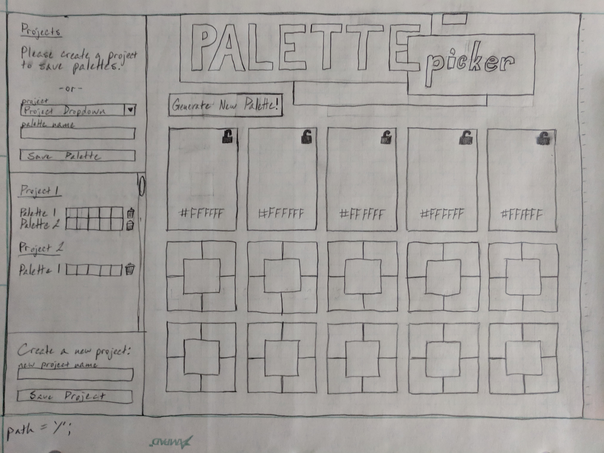

# Palette Picker

Palette Picker is a module 4 individual assignment at the Turing School of Software and Design. My goal was to make a useful palette creation tool for frontend developers where the interactions of all colors in the palette are more apparent than most online palette generation tools.

### See it Live

https://j-erickson-palette-picker.herokuapp.com/

### Technologies Used

* JavaScript/HTML/CSS
* Knex
* PostgreSQL
* Express
* Node
* Mocha
* Chai
* Travis CI
* Heroku

### Setup

This setup assumes that you have PostgreSQL installed locally. Find your operating system on this page, then follow the instructions to download PostgreSQL to your machine: https://www.postgresql.org/download/

1. Clone down repo
2. Change to root directory

`cd palette-picker`

3. Install dependencies

`npm install`

4. Create local databases

`psql
CREATE DATABASE palettepicker;
CREATE DATABASE palettepicker_testing;
\q`

5. Run migrations

`knex migrate:latest`

6. Seed the database

`knex seed:run`

7. Start the server

`npm start`

8. Visit `localhost:3000` in your browser

### Heroku Deployment Steps

This deployment relies on you having a Heroku account and the associated CLI tools. To make a Heroku account, fill out and submit the form here: https://signup.heroku.com/. To download the CLI tools, follow the instructions on this page: https://devcenter.heroku.com/articles/getting-started-with-nodejs#set-up.

1. Clone repo

`git clone https://github.com/Jessica-Erickson/palette-picker`

2. Change directory to repo

`cd palette-picker`

3. Create heroku app

`heroku create`

4. Provision a database

`heroku addons:create heroku-postgresql:hobby-dev`

5. Deploy the app

`git push heroku master`

6. Run the knex migration

`heroku run knex migrate:latest`

7. Seed the database (optional)

`heroku run knex seed:run`

8. Open in heroku

`heroku open`

### Test Driven Development

Palette Picker uses Mocha and Chai for API testing

Run command `npm test` from the root directory after following all steps from the setup section

### Next Steps

* Make Palette Picker responsive for use on tablets and phones.
* Add some fun animations.
* Add user auth, so that palettes/projects can be saved to, and deleted from, specific users

### Initial Planning

#### Desktop Version

### Original Assignment

[Palette Picker](http://frontend.turing.io/projects/palette-picker.html) from the Turing School of Software & Design

### Contributors

Jessica Erickson: [GitHub](https://github.com/Jessica-Erickson), [LinkedIn](https://www.linkedin.com/in/j-m-erickson/), [Twitter](https://twitter.com/J_M_Erickson)